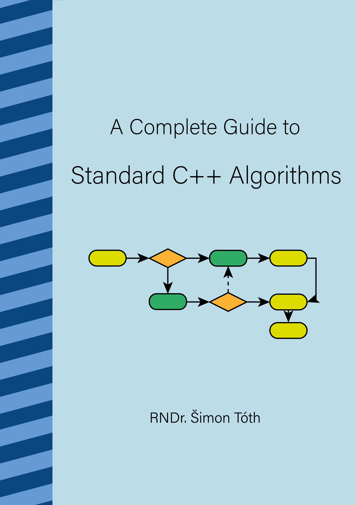

# Book: A Complete Guide to Standard C++ Algorithms

This repository contains the LaTeX source and C++ code samples for the book "A Complete Guide to Standard C++ Algorithms".

[Latest PDF release (v1.0.1)](https://github.com/HappyCerberus/book-cpp-algorithms/releases/download/v1.0.1/a_complete_guide_to_standard_cpp_algorithms_v1_0_1.pdf)

## Changelog

- `1.0.1` Small (mostly) formatting fixes.
- `1.0.0` Content complete release with Compiler Explorer links.
- `0.3.0` New chapter with ADL information and formatting cleanup.
- `0.2.1` Fixed page numbering issue, small text changes.
- `0.2.0` Added chapter covering C++20 ranges and views.
- `0.1.1` Added index and a cover page, small text changes.
- `0.1.0` First pre-release

## Building from sources

The repository is configured with VSCode devcontainer support.

Make sure that you have VSCode and Docker installed, then simply open the repository in VSCode. You will be prompted to reopen the project in a docker image.

VSCode is configured to use the LaTeX Workshop extension. To build the PDF simply press `CTRL+ALT+B` or select `LaTeX Workshop: Build LaTeX Project` from the command palette.
Note that due to the high number of code examples, the build does take a while.
The resulting PDF will be in the build folder.

### Code samples

Most code files have wrapping main files that exercise both the build and also contain `assert` expressions that verify correctness of the code.

The `verify.sh` shell script will build all (except for a few that don't compile with GCC 11) examples, and then run each of them to validate all asserts.

## Alternative approach of building from sources

This section was provided by [@wxinix](https://github.com/wxinix). Please direct any questions to him.

[Texstudio](https://www.texstudio.org/) offers an alternative solution for Windows users who are building from sources within a virtual machine and are unable to use the VSCode and Docker approach. Follow the steps below:

- Install [Anaconda](https://www.anaconda.com/) and add `C:\Users\YourUserName\anaconda3\Scripts` to system path. Replace `YourUserName` with your actual user name.
- Install [Texstudio](https://www.texstudio.org/). 
- Go to Texstudio menu "Options -> Configure Texstudio -> Commands -> XeLaTex", and enter the following command: `xelatex.exe -synctex=1 -interaction=nonstopmode -shell-escape -aux-directory=build -output-directory=build %.tex`. This command sets both the aux and output directories to ".\build".
- Go to Texstudio menu "Options -> Configure Texstudio -> Build -> Meta Commands -> Default Compiler", and enter `txs:///xelatex`. This switches the default compiler from `pdflatex` to `xelatex`. Then, enable the checkbox "Show Advanced Options".
- For Texstudio menu "Options -> Configure Texstudio -> Build -> Build Options -> PDF File", enter `build`. This tells the pdf previewer to look for the generated pdf file in the ".\build" directory.
- Finally, go to "Texstudio menu Options -> Configure Texstudio -> Commands -> Makeindex", and enter the following command: `makeindex.exe build%.idx`
  
These steps will enable you to build from sources inside a virtual machine using TexStudio on Windows. Ask @wxinix if you have any questions.
